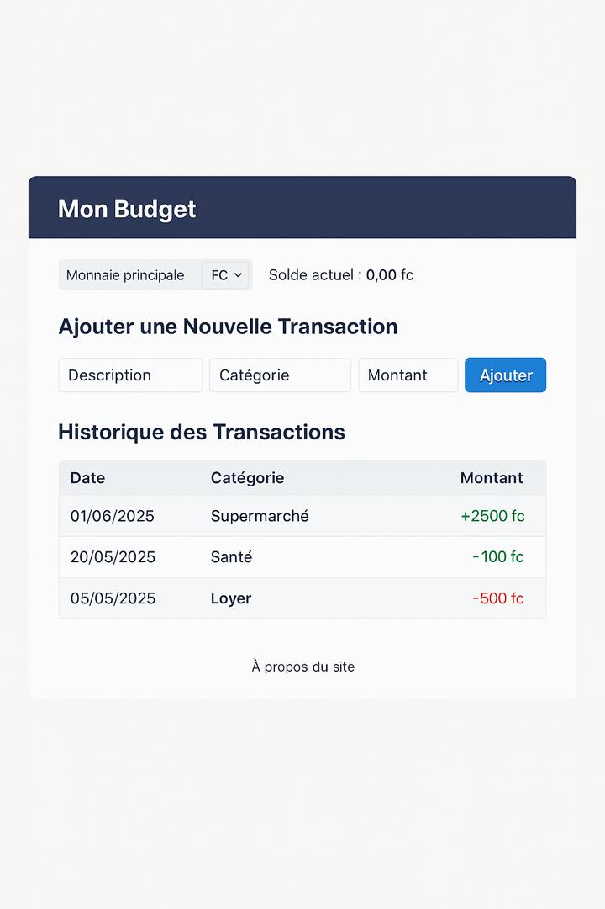

# 💰 Site Web de Gestion de Budget Personnel

Ce projet est un *site web de gestion de budget personnel*, réalisé dans le cadre d’un projet de fin d’année universitaire. Il permet à un utilisateur de suivre ses revenus et ses dépenses, d’avoir un aperçu de son solde actuel, et de visualiser son historique de transactions.

## ✨ Fonctionnalités

- Ajout de transactions (revenus ou dépenses)
- Catégories personnalisées (salaire, santé, transport, etc.)
- Saisie de la *description, **catégorie, **montant, et **date*
- Affichage dynamique de l’historique sous forme de tableau
- Calcul automatique du solde total en *francs congolais (FC)* et en *dollars ($)*
- Affichage visuel :
  - Revenus en *vert* avec un signe +
  - Dépenses en *rouge* avec un signe -
- Sauvegarde automatique des données dans le *navigateur* (localStorage)
- Design moderne et responsive inspiré d’une maquette

## 🛠 Technologies utilisées

- *HTML5*
- *CSS3*
- *JavaScript*

## 📂 Structure du projet

├── budget.html           –> Page principale
├── apropos.html         –> Page “À propos du site”
├── style.css            –> Feuille de style principale
├── script.js            –> Fichier JavaScript (logique de l’application)
└── README.md            –> Fichier de présentation du projet

## 📸 Apperçu du site

 

## 🔒 Limitations actuelles

- Les données sont stockées localement (localStorage)
- Aucune création de compte utilisateur (pas encore de base de données ni de back-end)
- Le site est monopage et ne gère pas encore plusieurs utilisateurs

## 🔜 Évolutions possibles

- Intégration d’un back-end (Node.js, Express, MongoDB)
- Authentification par compte utilisateur
- Filtres avancés : par mois, par catégorie
- Graphiques dynamiques (ex. : Chart.js)

## 📄 Auteur

Projet réalisé par *[AZARIA NGOY ]*  
Déposé sur GitHub dans le cadre d’un projet universitaire (année 2025).